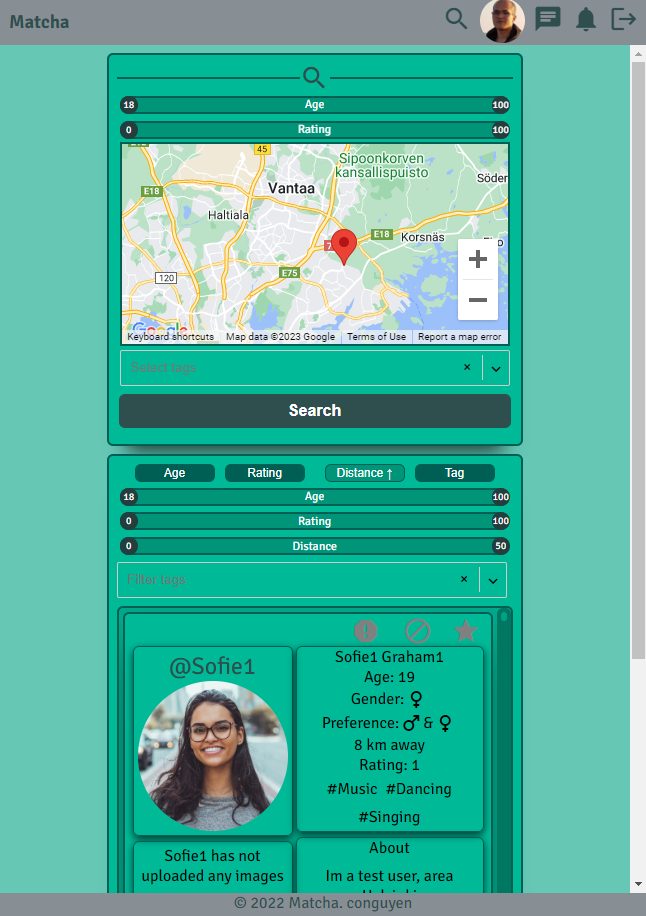

# Matcha
Matcha is the second project of the web branch in Hive Helsinki.  
This project is about creating a dating website. 
You will need to create an app allowing two potential lovers to meet, 
from the registration to the final encounter.

A user will then be able to register, connect, fill his/her profile, 
search and look into the profile of other users, like them, 
chat with those that “liked” back.

## Stack

```console
	* React
	* Node.js
	* Express.js
	* MySQL
	* Socket.io
```

## Landing

## Home

## User Profile

## Search

## Chat


## Installing node on School computers with nvm

1. Check url https://github.com/nvm-sh/nvm/releases and see which version is the latest.
2. Change the version number accordingly, and install with:
```console
curl -o- https://raw.githubusercontent.com/nvm-sh/nvm/v0.39.1/install.sh | bash
```

The installation should add nvm PATH to your .zshrc/.profile/.bashrc automatically. Restart the terminal if needed.

2. to install node with nvm run command:
```console
nvm install --lts
```
